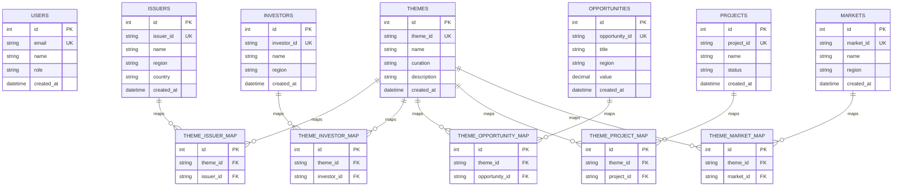

# Regenify Data Model (Client Draft)

## Scope
This document shows:
- Current SQL schema already implemented.
- Proposed v1 expansion for business entities.
- SQL ↔ Neo4j integration approach using shared IDs.

## 1) Current Implemented SQL Schema

### `users`
- `id` (PK, integer, auto increment)
- `email` (varchar(320), unique, indexed)
- `name` (varchar(255))
- `role` (varchar(32), default: `user`)
- `created_at` (timestamp with timezone, default now)

### `themes`
- `id` (PK, integer, auto increment)
- `theme_id` (varchar(128), unique, indexed)  
  This is the cross-database key that links SQL rows to Neo4j `Theme.id`.
- `name` (varchar(255))
- `curation` (varchar(512))
- `description` (varchar(2000))
- `created_at` (timestamp with timezone, default now)

## 2) Proposed v1 Expansion (Presentation Model)

### Core Entity Tables
- `issuers`
- `investors`
- `opportunities`
- `projects`
- `markets`

### Mapping / Relationship Tables (SQL side)
- `theme_issuer_map` (`theme_id`, `issuer_id`)
- `theme_investor_map` (`theme_id`, `investor_id`)
- `theme_opportunity_map` (`theme_id`, `opportunity_id`)
- `theme_project_map` (`theme_id`, `project_id`)
- `theme_market_map` (`theme_id`, `market_id`)

### Governance / Metadata (optional but recommended)
- `source_registry` (data provenance)
- `ingestion_jobs` (pipeline run history)
- `audit_log` (admin/user and data change events)

## 3) SQL ↔ Neo4j Integration Pattern

### Design Decision
- Keep PostgreSQL and Neo4j physically separate.
- Link logically using shared stable IDs (for example `theme_id`).

### Example Shared Keys
- SQL `themes.theme_id = "entrepreneurship"` ↔ Neo4j `(t:Theme {id: "entrepreneurship"})`
- Future:
  - SQL `issuers.issuer_id` ↔ Neo4j `(i:Issuer {id: ...})`
  - SQL `projects.project_id` ↔ Neo4j `(p:Project {id: ...})`

### Why This Works Well
- Avoids hard coupling.
- Supports phased delivery.
- Enables composite APIs in FastAPI that merge SQL and graph insights.

## 4) ERD (SQL-Focused, v1 Proposed)

## 5) Suggested Client Narrative
- Phase 1: Implemented baseline schema for users and curated themes.
- Phase 2: Add issuer/investor/opportunity/project/market relational tables.
- Phase 3: Complete graph enrichment in Neo4j and serve hybrid analytics endpoints.
- Integration principle: one canonical ID per entity shared across SQL and Neo4j.

## 6) Demo Sample Data (for Client Presentation)

Use this as a simple storytelling example.

### Example Themes
- `entrepreneurship`
- `sustainable-development`
- `future-of-work`
- `social-justice`

### Example Issuers (SQL)
| issuer_id | name | region | country |
|---|---|---|---|
| `issuer_eib` | European Investment Bank | Europe | Luxembourg |
| `issuer_ngc` | Nordic Green Capital | Europe | Sweden |
| `issuer_acf` | Asia Climate Fund | Asia | Singapore |

### Example Investors (SQL)
| investor_id | name | region |
|---|---|---|
| `investor_nordic_pension` | Pension Fund Nordic | Europe |
| `investor_impact_asia` | Impact Capital Asia | Asia |
| `investor_us_climate` | US Climate Fund | North America |

### Theme-to-Issuer Mapping (SQL)
| theme_id | issuer_id |
|---|---|
| `entrepreneurship` | `issuer_ngc` |
| `sustainable-development` | `issuer_eib` |
| `sustainable-development` | `issuer_acf` |
| `future-of-work` | `issuer_ngc` |

### Theme-to-Investor Mapping (SQL)
| theme_id | investor_id |
|---|---|
| `entrepreneurship` | `investor_impact_asia` |
| `future-of-work` | `investor_us_climate` |
| `social-justice` | `investor_nordic_pension` |
| `sustainable-development` | `investor_us_climate` |

### How This Looks in Neo4j (conceptually)
- `(Theme:entrepreneurship)-[:RELATED_ISSUER]->(Issuer:issuer_ngc)`
- `(Theme:sustainable-development)-[:RELATED_ISSUER]->(Issuer:issuer_eib)`
- `(Theme:future-of-work)-[:RELATED_INVESTOR]->(Investor:investor_us_climate)`
- `(Investor:investor_impact_asia)-[:INVESTS_IN]->(Issuer:issuer_acf)`

### Client-Friendly Explanation
- “Themes sit at the center of the knowledge model.”
- “Issuers and investors are connected to themes they influence or finance.”
- “SQL stores the clean master records; Neo4j stores relationship intelligence.”
- “This lets us answer both reporting questions (SQL) and network questions (graph).”
